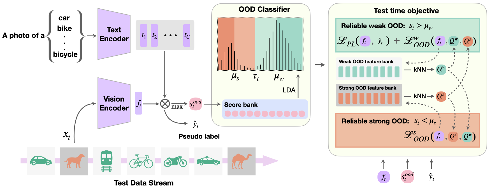

# ROSITA

Official code implementation for the paper [Efficient Open Set Single Image Test Time Adaptation of Vision Language Models](https://openreview.net/forum?id=72YVabBErN)

[Manogna Sreenivas](https://manogna-s.github.io/), [Soma Biswas](https://sites.google.com/iisc.ac.in/somabiswas)

<!-- [Paper](https://openreview.net/forum?id=72YVabBErN) -->

---



> <p align="justify"> <b> <span style="color: green;">ROSITA framework</span></b>:
>     Adapting models to dynamic, real-world environments characterized by shifting data distributions and unseen test scenarios is a critical challenge in deep learning. In this paper, we consider a realistic and challenging Test-Time Adaptation setting, where a model must continuously adapt to test samples that arrive sequentially, one at a time, while distinguishing between known and unknown classes. Current Test-Time Adaptation methods operate under closed-set assumptions or batch processing, differing from the real-worls open-set scenarios. We address this limitation by establishing a comprehensive benchmark for Open-set Single-image Test-Time Adaptation using Vision-Language Models. Furthermore, we propose ROSITA, a novel framework that leverages dynamically updated feature banks to identify reliable test samples and employs a contrastive learning objective to improve the separation between known and unknown classes. Our approach effectively adapts models to domain shifts for known classes while rejecting unfamiliar samples. Extensive experiments across diverse real-world benchmarks demonstrate that ROSITA sets a new state-of-the-art in open-set TTA, achieving both strong performance and computational efficiency for real-time deployment.

---

### Installation

Please follow the instructions at [INSTALL.md](docs/INSTALL.md) to setup the environment.

### Dataset preparation

Please follow the instructions at [DATASETS.md](docs/DATASETS.md) to prepare the datasets.

### Experiments

To run a specific experiment, select the desired, undesired class datasets, base VLM and the TTA method to evaluate from the following list.

```
python owtta.py --desired [cifar10/cifar100/ImageNetC/ImageNetR/DN-Clipart/DN-Painting/DN-Sketch/VisDA/CCC] --undesired [MNIST/SVHN/Tiny/cifar10/cifar100] --model [clip/maple] --tta_method [ZSEval/ROSITA/TPT/TPTContinual/PromptAlign/PromptAlignContinual/PC/TDA/UniEnt/DPE]
```

For e.g., to run PromptAlign using MaPLe as the VLM, CIFAR-10C as desired class and Tiny ImageNet as undesired class dataset, the following command should be used.

```
python owtta.py --desired cifar10 --undesired Tiny --model maple --tta_method ROSITA
```

Please find the detailed instructions to run the experiments at [RUN.md](docs/RUN.md) .

---

### Acknowledgements

We thank the authors of [TPT](https://github.com/azshue/TPT), [PromptAlign](https://github.com/jameelhassan/PromptAlign), [OWTTT](https://github.com/Yushu-Li/OWTTT) for their open-source codes.
